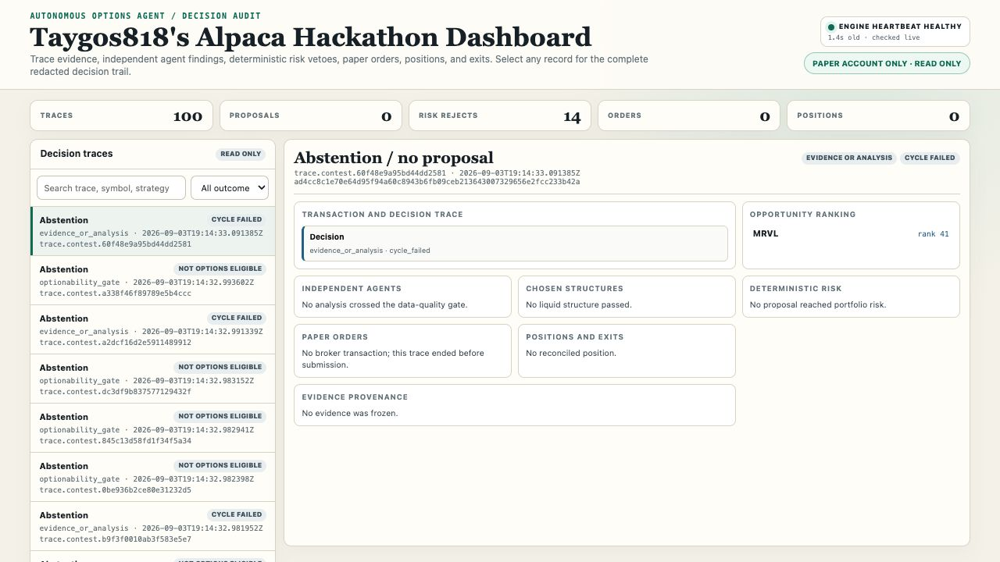

# Alpaca Trading Bot

An autonomous, multi-agent options trading system for the 2026 Alpaca AI Trading Agents Hackathon. This repository is intentionally restricted to Alpaca paper trading.

## Safety boundary

- The only accepted trading endpoint is `https://paper-api.alpaca.markets`.
- Paper mode and broker-state reconciliation are mandatory.
- Order submission starts disabled; dry-run is the default.
- AI agents may research and propose trades but cannot bypass deterministic portfolio risk controls or construct arbitrary broker commands.
- Never copy credentials, logs, databases, or runtime artifacts from another trading project.

## Competition strategy

The planned primary strategy uses catalyst-confirmed directional call and put debit spreads. A Level 2 paper account may use defined-risk long calls and puts until Level 3 spreads are available. The opportunity universe is dynamic and filtered for options eligibility and liquidity.

See the required [Hackathon Judging One-Pager](docs/HACKATHON_JUDGING.md), plus [Contest Architecture](docs/CONTEST_ARCHITECTURE.md), [Decision Contracts](docs/DECISION_CONTRACTS.md), [Multi-Agent Coordinator](docs/MULTI_AGENT_COORDINATOR.md), [Milestones](docs/MILESTONES.md), [Data Provider Plan](docs/DATA_PROVIDER_PLAN.md), [External Data Provenance](docs/EXTERNAL_DATA_PROVENANCE.md), [Featherless Autonomous Analysis](docs/FEATHERLESS_ANALYSIS.md), [Defined-Risk Options Strategy](docs/DEFINED_RISK_OPTIONS.md), [Replay and Bounded Paper Launch](docs/PAPER_LAUNCH.md), and [Agent Decision Dashboard](docs/AGENT_DASHBOARD.md).

## Dashboard

The read-only dashboard makes every autonomous decision inspectable. It displays:

- the live engine heartbeat and paper-account safety boundary;
- aggregate counts for traces, proposals, risk rejections, orders, and positions;
- searchable and filterable decision traces, including abstentions and their gate-level reasons;
- the selected opportunity's ranking, independent-agent findings, chosen options structure, deterministic risk decision, paper-order lifecycle, reconciled position and exit state, and evidence provenance; and
- an expandable activity log for order submissions, fills, exits, and other runtime events.

Selecting a trace reconstructs the complete redacted path from market evidence through autonomous analysis, deterministic risk oversight, execution, and position management. See [Agent Decision Dashboard](docs/AGENT_DASHBOARD.md) for operating details.

## Hackathon submission media

- [Narrated screen-led demo (MP4)](docs/submission/Taygos818-Options-Bot-Demo.mp4)
- [Eight-slide presentation (PDF)](docs/submission/Taygos818-Options-Bot-Hackathon-Deck.pdf)
- [Narration transcript](docs/submission/Taygos818-Options-Bot-Narration.txt)
- [Taygos818 Options Bot cover](docs/submission/Taygos818-Options-Bot-Cover.png)

## Bootstrap

1. Copy `.env.example` to `.env.paper.secrets`.
2. Add only Alpaca paper credentials and a Featherless API key.
3. Keep `PAPER_ORDER_DRY_RUN=true` and `PAPER_ORDER_SUBMISSION_ENABLED=false`.
4. Validate configuration with `docker compose config`.
5. Run tests before starting any service.

Paper-order execution will remain disabled until its milestone acceptance gates pass.

## Provenance

The initial safety, reconciliation, persistence, and market-data architecture was derived from the owner's validated `trading-bot-us` commit `975aa8bbc3a4de674fa28912bc998e2da00bfa2a`. Git history, live-only deployment configuration, runtime data, secrets, and dormant AI modules were not copied.

## License

MIT. See [LICENSE](LICENSE).
